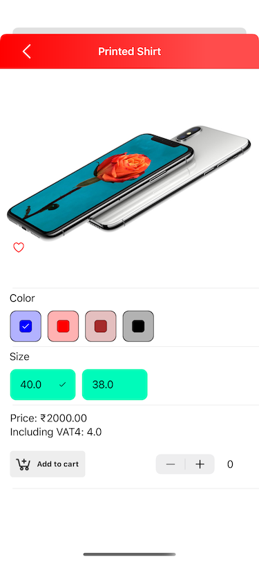

# Heady ​- ​Skill ​Assessment ​Test ​(SAT)

## Project name 
```bash
Heady
```
## Language 
```bash
Swift 5.1
```
## IDE  
```bash
Xcode 11.6.1
```

## Mechanism  

- Database: `Core Data & UserDefaults`
- Network: `NSURLSession`
- `No third party library is being used`

## Highlights  

- `Object oriented programing(OOP), Protocol oriented programing, MVVM, SOLID, Singleton, Delegate, Callback `
- `Thread safe core data using multiple context`
- `JSON parsing using Codable`
- `Category navigation storing data using custom stack`
- `Fully customized tab bar`
- `Simple side menu`
- `Custom spinner using core animation` 
- `All extension classes (File name having +)`

## Features

- Side Menu
  - Shop by Category: `Category and Sub category list`
  - Most Viewed: `Most Viewd Prodcuts`
  - It's Trending: `Most Ordered Prodcts`
  - Lucrative Products: `Most Shared Prodcuts`
  - All Products: `List of all products`

- Tabs
  - Shop: `Manipulating categories and products using side menu` 
  - Wish list: `Dynamic wish list as per user wished by tapping heart button in product details page`
  - Cart: `Dynamic cart as per user added to buy products with variants and subtotal price with respect to quantity`
  - Notification: `Feature is not developed`
  - Settings: `Feature is not developed`

- Product Details
  - Dynamically manipulated all the variants
  - User can add/remove a product to their wish list by tapping heart 
  - User can add product to their cart

## Preview




 


## Contributing
Pull requests are welcome. For major changes, please open an issue first to discuss what you would like to change.

Please make sure to update tests as appropriate.

## Copyright
`Sayak Shobhan Khatua` `Heady`
